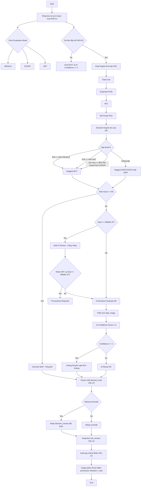

# LUỒNG QUYẾT ĐỊNH ĐẦU TƯ TÀI SẢN THÔNG MINH (DECISION FLOW)

## 1️⃣ Đầu vào & Quản trị dữ liệu (DGR – SR)

### Bước 1: Nhập liệu tài sản chuẩn hóa

- ID tài sản
- Phân loại (IT / Công nghiệp / ART…)
- Giá mua
- Chọn chế độ đánh giá:
    - RESALE
    - SCRAP
    - ART

### Bước 2: Kiểm tra độ đầy đủ dữ liệu

Nếu thiếu dữ liệu nghiêm trọng:

- Chặn BUY
- AI Confidence ≤ 2

👉 Đây là lớp kiểm soát đầu tiên trước khi tính toán.

## 2️⃣ Động cơ tài chính & Quy tắc (FRL & DR – BR)
### Tính toán tài chính tự động

- FRL-01: Tổng chi phí
- FRL-02: Lợi nhuận kỳ vọng
- FRL-03: ROI (tỉ xuất lợi nhuận)
- FRL-04: Net Scrap Floor (giá sàn phế liệu sau khi trừ chi phí)

### Logic đề xuất quyết định (Decision Engine)

Đề xuất BUY nếu:

- ROI ≥ 25% (RESALE)
- ROI ≥ 40% (ART)
- Giá mua ≤ 80% Net Scrap Floor (SCRAP)

Ngược lại → NEGOTIATE hoặc SKIP

## 3️⃣ Cổng kiểm soát rủi ro & AI (RR & AR)
### Cổng đỏ – Risk Override

- Risk ≥ 80 → Tự động SKIP
- Override toàn bộ logic tài chính

### Cổng vàng – Deal lớn

- Deal ≥ 300,000 JPY → Bắt buộc AI Review
- ART ≥ 300,000 JPY → Bắt buộc Provenance

## 4️⃣ Đánh giá AI Reviewer

AI trả về:

- Phân tích

- Cảnh báo

- Confidence Score (1–5)

### Confidence Gating ( )

- Confidence ≤ 2 → Không khuyến nghị BUY
- Chặn BUY (gating)

## 5️⃣ Chốt quyết định & Kiểm toán (CRL)
### Quyết định cuối cùng

- Thuộc về con người

- Nếu override → bắt buộc ghi lý do

### Snapshot phiên bản rule

- Ghi lại rule_version tại thời điểm chốt

### Nhật ký kiểm toán

Log các trường quan trọng:

- Giá mua
- Chế độ đánh giá
- Điểm rủi ro
- Người phê duyệt

## 🎯 Tóm tắt các ngưỡng kiểm soát v1.1

| Kiểm soát          | Ngưỡng                           | Hành động |
| ------------------ | -------------------------------- | --------- |
| Risk ≥ 80          | → SKIP                           |           |
| Deal ≥ 300,000 JPY | → Bắt buộc AI Review             |           |
| ROI ≥ 25% (Resale) | → BUY                            |           |
| ROI ≥ 40% (Art)    | → BUY (cần Provenance nếu ≥300k) |           |
| AI Confidence ≤ 2  | → Không cho BUY                  |           |

## 🔥 Bản chất của luồng này

Luồng được thiết kế theo nguyên tắc:

- Data →

- Financial logic →

- Risk override →

- AI validation →

- Human final decision →

- Audit snapshot

Nó kết nối chặt giữa:

- CR (Mục tiêu bảo vệ vốn)
- SR (Yêu cầu hệ thống)
- BR (Quy tắc nghiệp vụ)

## Sơ đồ
